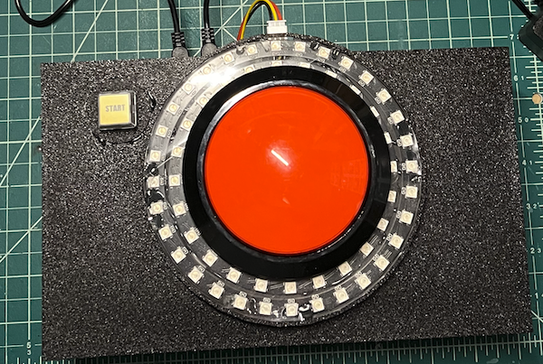

# Raspberry Pi Pico Game Controller

This project implements a basic game controller system using a Raspberry Pi Pico microcontroller. The controller features physical buttons for user input and an addressable LED strip for visual feedback, communicating with PC games via USB serial connection.




## Overview

The Pico Game Controller is a dual-core system that simultaneously:
- Monitors button states and sends button events to the connected PC
- Receives LED control commands from the PC and displays visual patterns
- Provides real-time feedback through a NeoPixel LED array

## Hardware Requirements

### Components
- Raspberry Pi Pico (with MicroPython firmware)
- 2x Push buttons (normally open)
- 1x NeoPixel LED ring strip (56 LEDs: 32 outer + 24 inner ring)
- Appropriate wiring
- External 5V power supply with USB micro connector (recommended for LED strip)

### Wiring Diagram

```
Raspberry Pi Pico Pinout:
┌──────────────────────┐
│ GPIO 5 → NeoPixel    │ (Data Output)
│ GPIO 6 → Main Button │ (Pull-up, Active Low)
│ GPIO 7 → Start Button│ (Pull-up, Active Low)
└──────────────────────┘
```

**Important Notes:**
- Buttons are configured with internal GPIO pull-up resistors (active low)
- LED strip requires external 5V power supply with USB micro connector for optimal performance
- A separate USB connection provides both power and data communication between Pico and PC


## Software Architecture

### Pico Firmware (MicroPython)

The firmware consists of several modular components:


#### Core Files
```
/
├── main.py                 # Main controller loop and message processing
├── GameMessages.py         # Button handling and USB serial communication
├── LedArray.py            # LED pattern control and dual-core execution
└── pico_game_controller.py # Original main controller loop
```

#### Key Features
- **Dual-core processing**: LED patterns run on core 1 while main logic runs on core 0
- **Non-blocking I/O**: Button monitoring and serial communication don't interfere with LED animations
- **Debounced inputs**: Software + hardware debouncing prevents spurious button events
- **JSON messaging**: Structured communication protocol between Pico and PC

### PC Game Integration

#### Supported Games
```
sample/click3.py    # 30-second click counter game with LED feedback
```

(Original code from: https://github.com/seigot/game)

The PC games communicate with the Pico controller via USB serial using JSON messages.

## Communication Protocol

### Message Format
All messages are exchanged as JSON objects over USB serial at 115200 baud.

### Button Events (Pico → PC)

When buttons are pressed, the Pico sends button event messages:

```json
{
  "time": 57120.42,
  "event": "button", 
  "state": {
    "start_button": true,
    "pressed": true
  }
}
```

```json
{
  "time": 57121.02,
  "event": "button",
  "state": {
    "main_button": true,
    "pressed": true
  }
}
```

**Button Event Fields:**
- `time`: Timestamp in milliseconds
- `event`: Always "button" for button events
- `state.start_button`: true when start button is pressed
- `state.main_button`: true when main button is pressed
- `state.pressed`: Always true (only press events are sent)

### LED Control Commands (PC → Pico)

The PC can control LED patterns by sending pattern commands:

```json
{"led": {"pattern": 0}}  # Pattern 0: Idle/demo pattern
{"led": {"pattern": 1}}  # Pattern 1: Rotating colors
{"led": {"pattern": 2}}  # Pattern 2: Pulsing effect
{"led": {"pattern": 3}}  # Pattern 3: Random sparkle
```

**LED Pattern Details:**
- **Pattern 0**: Demo pattern with random effects (idle state)
- **Pattern 1**: Sequential color rotation around the ring
- **Pattern 2**: Synchronized pulsing with color transitions
- **Pattern 3**: Random LED sparkle effect with multiple colors

## Setup Instructions

### 1. Pico Firmware Installation

1. Install MicroPython on your Raspberry Pi Pico
2. Use VS Code with the MicroPico extension for development
3. Upload all files in the root directory to the Pico:
   ```
   GameMessages.py
   LedArray.py  
   main.py
   ```

### 2. PC Environment Setup

1. Install required Python packages:
   ```bash
   pip install pygame pyserial
   ```

2. Connect the Pico via USB and identify the serial port:
   ```bash
   # Linux: usually /dev/ttyACM0
   # Windows: usually COM3, COM4, etc.
   # macOS: usually /dev/cu.usbmodem*
   ```

3. Update the serial device path in `sample/click3.py`:
   ```python
   ser_device='/dev/ttyACM0'  # Adjust for your system
   ```

### 3. Hardware Assembly

1. Connect buttons to GPIO 6 (main) and GPIO 7 (start)
2. Connect NeoPixel data line to GPIO 5
3. Connect external 5V power to LED strip
4. Ensure common ground between all components

## Usage

### Running the Game

1. Power on the Pico and ensure firmware is loaded
2. Connect via USB to PC
3. Run the click game:
   ```bash
   python sample/click3.py
   ```

### Game Controls

- **Start Button (GPIO 7)**: Start new game/restart
- **Main Button (GPIO 6)**: Primary game action (clicking)
- **LED Feedback**: Visual indication of game state and score

### LED Pattern Behavior

The LED patterns respond to game events:
- Game start: Pattern changes to indicate active state
- Game progress: Different patterns for visual feedback  
- Game end: Return to idle pattern

## Technical Details

### Button Debouncing
`GameMessages.py` implements software debouncing with a configurable delay (default 10ms) to prevent false button events from mechanical switch bounce.

### LED Performance
- 56 total LEDs (32 outer ring + 24 inner ring)
- RGB color depth: 8-bit per channel (reduced brightness for power efficiency)
- Refresh rate: ~14Hz for smooth animations
- Dual-core execution prevents LED stuttering

### Serial Communication
- Baud rate: 115200 bps
- Protocol: JSON over UTF-8
- Error handling: Malformed messages are ignored
- Buffer management: Non-blocking reads prevent system lockup

## Troubleshooting

### Common Issues

1. **No button response**: Check wiring and GPIO pin assignments
2. **LED strip not working**: Verify external power supply and data connection
3. **Serial communication errors**: Confirm correct port and baud rate
4. **LED flickering**: Ensure stable power supply for LED strip

## Development

### Adding New LED Patterns

To add new LED patterns, modify `LedArray.py`:

1. Create a new `run_pattern_N()` method
2. Update the pattern selection logic in `led_run()`
3. Test the pattern with the appropriate JSON command

### Extending Button Functionality

Additional buttons can be added by:
1. Modifying the GPIO pin assignments in `GameMessages.py`
2. Adding new button event types
3. Updating the PC game to handle new button events
